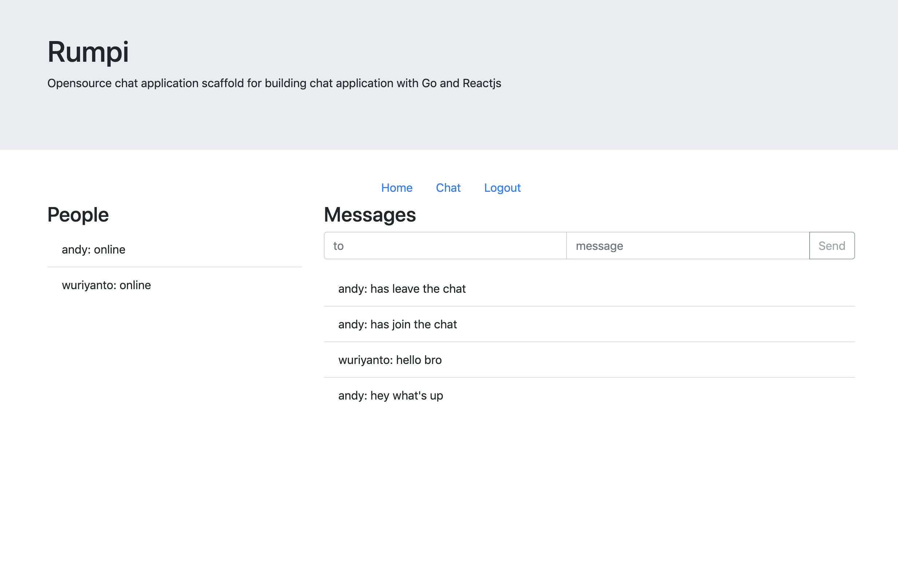

# Opensource chat application scaffold for building chat application with Go and Reactjs

# Note:
This project still in active development

## Current preview with Reactjs Client
[](https://github.com/musobarlab/rumpi)

## Server Side
Server side uses Go and Gorrilla

## Client Side
There are two client side applications you can choose, either Reactjs or Nodejs with express

# Running Server

```shell
$ make build

$ ./rumpi
```

# Running Client

## Node Client `deprecated and not maintained, please use the Reactjs client instead`
https://github.com/musobarlab/rumpi/tree/master/client/node-client
```shell
$ cd client/node-client
$ npm install
$ npm start
```

Or with specific `PORT`

```shell
$ PORT=3000 npm start
```

Visit http://localhost:3000

## Reactjs Client
https://github.com/musobarlab/rumpi/tree/master/client/react-client

replace this config with your own config
https://github.com/musobarlab/rumpi/blob/master/client/react-client/src/index.js#L9
```shell
$ cd client/react-client
$ npm install
$ npm start
```